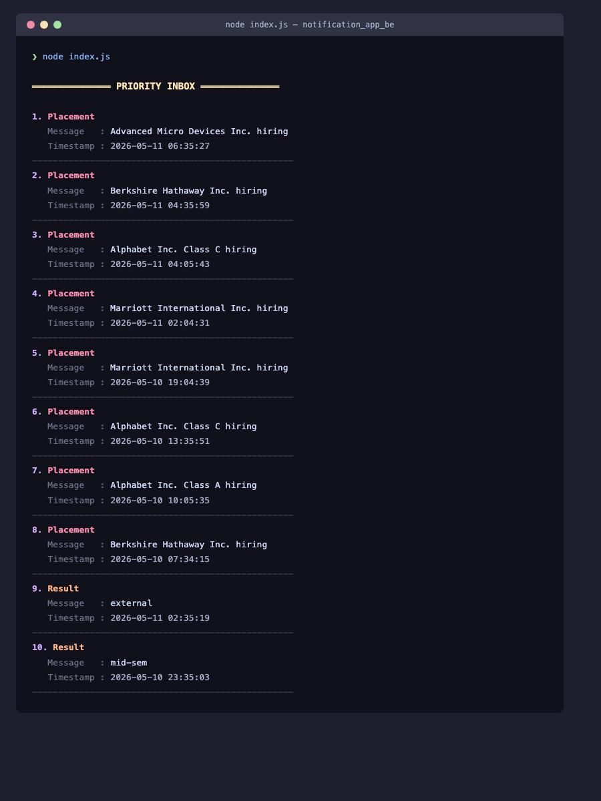
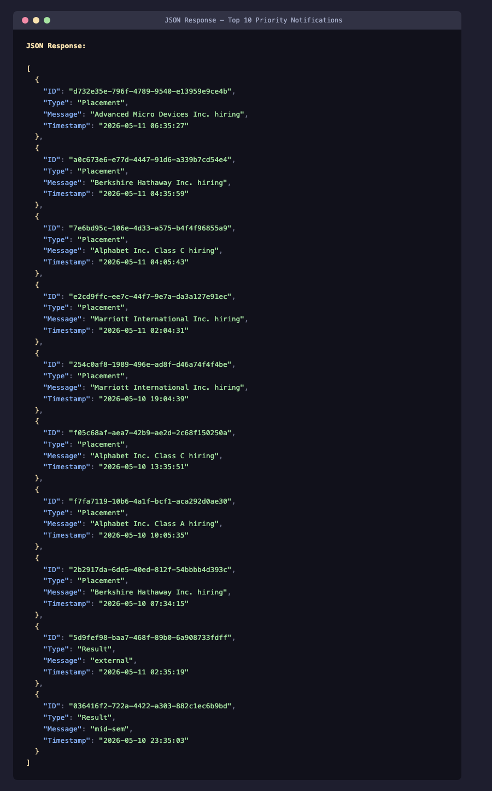

# Stage 1 — Priority Inbox

## Overview

Students receive a large number of campus notifications every day related to placements, results, workshops, events, hackathons, and other activities. Because of this, important notifications are often missed.

The objective of this task is to build a **Priority Inbox System** that filters and displays the most important notifications first.

The system prioritizes notifications based on:

- Notification type
- Notification recency

Only the top `N` notifications are returned to the user.

---

# Priority Strategy

The ranking system uses two factors:

## 1. Notification Type Weight

Each notification type is assigned a fixed priority weight.

| Type      | Weight |
| --------- | ------ |
| Placement | 3      |
| Result    | 2      |
| Event     | 1      |

This creates the following priority order:

```text id="v7j7vf"
Placement > Result > Event
```

Placement notifications always rank above Result and Event notifications.

---

## 2. Recency Score

For notifications of the same type, newer notifications should appear first.

The recency score is calculated using:

```text id="t9r4g4"
recencyScore = 1 / (1 + ageInSeconds)
```

Where:

- `ageInSeconds` is the difference between current time and notification timestamp
- Newer notifications receive a higher score
- Older notifications gradually lose importance

---

# Final Priority Score

The final score is calculated as:

```text id="ng1q1s"
priorityScore = typeWeight + recencyScore
```

This ensures:

- Notification type remains the main priority factor
- Recency helps rank notifications within the same category

---

# Algorithm

## Steps

1. Fetch notifications from the API
2. Calculate priority score for each notification
3. Sort notifications in descending order
4. Return top `N` notifications

---

## Pseudocode

```text id="0dfp5d"
function getTopNotifications(notifications, n):

    for each notification:
        calculate ageInSeconds
        calculate recencyScore
        priorityScore = typeWeight + recencyScore

    sort notifications by priorityScore descending

    return first n notifications
```

---

# Complexity Analysis

| Operation         | Complexity |
| ----------------- | ---------- |
| Score Calculation | O(k)       |
| Sorting           | O(k log k) |
| Top N Extraction  | O(n)       |

Overall:

```text id="0klc4w"
Time Complexity  : O(k log k)
Space Complexity : O(k)
```

Where `k` is the total number of notifications.

---

# Handling New Notifications

Notifications are continuously added to the system. To keep the inbox updated:

1. Notifications are fetched from the API periodically
2. Scores are recalculated each time
3. Notifications are sorted again
4. Top notifications are returned

This approach ensures that:

- Recent notifications move upward automatically
- Older notifications slowly move downward
- The inbox remains updated in real time

---

# Why This Approach?

## Why not sort only by timestamp?

Sorting only by timestamp could place less important event notifications above placement notifications.

Using priority weights ensures important notifications always appear first.

---

## Why not use database queries?

The task requirements specify that processing should happen in application logic after fetching notifications from the API.

Therefore, all scoring and sorting operations are performed in-memory.

---

# Technologies Used

- Node.js
- JavaScript
- Axios
- Logging Middleware
- Bearer Token Authentication

---


# Screenshots

## Terminal Output



---

## JSON Output





---

# Conclusion

The Priority Inbox system ranks campus notifications using notification type and recency. The implementation is simple, efficient, and easy to maintain.

The system:

1. Fetches notifications from the API
2. Calculates a priority score for each notification
3. Sorts notifications based on score
4. Returns the top `N` notifications

The design can also be extended in the future to support additional notification types, personalized ranking, and real-time updates.
